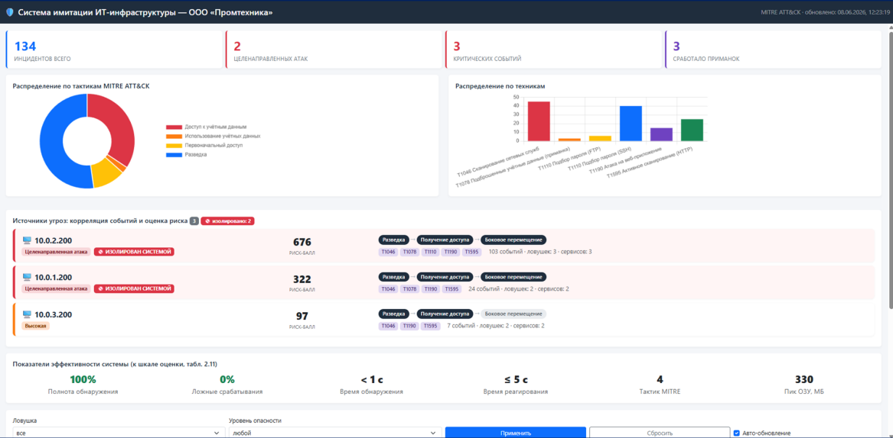
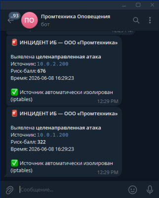
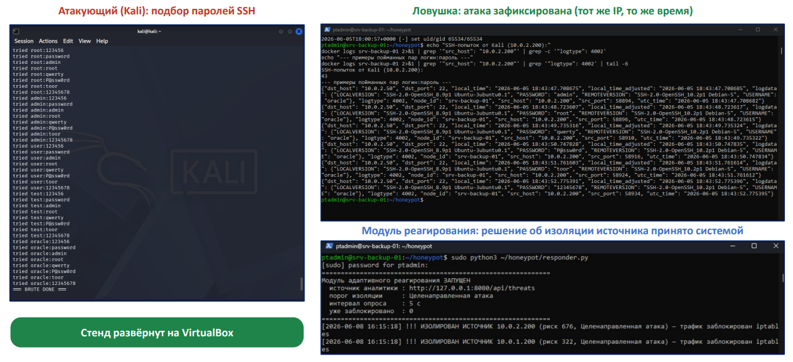

# Система имитации ИТ-инфраструктуры для выявления сетевых атак

Deception-система (honeypot-инфраструктура) с активным реагированием: имитирует
реальные ИТ-сервисы предприятия, обнаруживает атаки внутри сети, автоматически
классифицирует их по **MITRE ATT&CK**, оценивает риск и **самостоятельно изолирует
нарушителя**, отправляя тревогу службе ИБ.

> Выпускная квалификационная работа, кафедра «Информационная безопасность»,
> Севастопольский государственный университет, 2026.

---

## Проблема

Классическая защита (межсетевые экраны, сигнатурные IDS) работает на периметре и
ловит только известные сигнатуры. Нарушитель, прошедший периметр, остаётся
незамеченным внутри сети неделями. Нужен рубеж обнаружения **внутри** сети —
с ранним выявлением активности злоумышленника.

## Решение

Система ложных сервисов-приманок (honeypot), развёрнутых в сегментах внутренней
сети. Любое обращение к приманке — уже подозрительно, поэтому система даёт
**0% ложных срабатываний** и обнаруживает атаку за секунды.

## Архитектура

Конвейер обработки:

Смоделирована инфраструктура производственного предприятия (4 сетевых сегмента,
модель угроз — MITRE ATT&CK). Развёрнуто 4 приманки, имитирующие ценные узлы:

| Приманка       | Имитируемые сервисы | Порты        |
|----------------|---------------------|--------------|
| `srv-backup-01`| SSH, MySQL          | 22, 3306     |
| `srv-files-02` | FTP                 | 21           |
| `web-dev-01`   | HTTP                | 80           |
| `ws-hr-26`     | RDP                 | 3389         |

## Стек технологий

- **ОС:** Ubuntu (узел-ловушки), Kali Linux (АРМ нарушителя для тестов)
- **Контейнеризация:** Docker (каждая приманка — отдельный контейнер)
- **Honeypot-движок:** OpenCanary (`thinkst/opencanary`)
- **Реагирование:** Python (модуль `responder.py`) + iptables (авто-изоляция)
- **Аналитика/дашборд:** веб-интерфейс (REST API `http://127.0.0.1:8080/api/threats`)
- **Оповещения:** Telegram-бот
- **Модель угроз:** MITRE ATT&CK
- **Стенд:** VirtualBox
- Полностью на открытом ПО — без затрат на лицензии.

## Ключевые возможности

- **Имитация 5 сетевых сервисов** (SSH, FTP, HTTP, MySQL, RDP) на 4 приманках одновременно.
- **Автоматическая классификация атак по MITRE ATT&CK** — каждая атака размечается
  по тактикам и техникам (T1046, T1078, T1110, T1190, T1595 и др.).
- **Корреляция событий + оценка риска** — разрозненные события связываются в одну
  целенаправленную атаку с расчётом риск-балла по источнику.
- **Активная защита** — при превышении порога риска система сама блокирует источник
  через iptables (не пассивная ловушка) и оповещает службу ИБ в Telegram.
- **Веб-дашборд** — инциденты, целенаправленные атаки, критические события,
  распределение по тактикам/техникам MITRE, источники угроз с риск-баллами.

## Как это работает (пример)

1. Атакующий (Kali) запускает подбор паролей по SSH на приманку `srv-backup-01`.
2. Приманка фиксирует каждую попытку (логин:пароль, IP, время, порт).
3. Модуль корреляции связывает события с источника `10.0.2.200`, размечает по
   MITRE (разведка → получение доступа → боковое перемещение) и считает риск-балл (676).
4. При превышении порога `responder.py` изолирует источник через iptables и шлёт
   инцидент в Telegram службе ИБ.

## Результаты апробации

Пройдены все 6 сценариев атак: сканирование, подбор паролей, веб-атака, доступ к
файлам, срабатывание приманок, нагрузочное тестирование.

| Метрика                 | Значение |
|-------------------------|----------|
| Полнота обнаружения     | 100%     |
| Ложные срабатывания     | 0%       |
| Время обнаружения       | < 1 c    |
| Время реагирования      | ≤ 5 c    |
| Пиковое потребление ОЗУ | ≤ 330 МБ |
| Охвачено тактик MITRE   | 4        |

В сравнении с сигнатурным IDS (обнаружение внутри сети — дни/месяцы, много ложных
тревог) система обнаруживает атаки за секунды без ложных срабатываний.

## Чему научился на проекте

- Проектирование и развёртывание сетевой инфраструктуры на Linux
- Контейнеризация сервисов в Docker
- Настройка и эксплуатация honeypot (OpenCanary)
- Сбор, парсинг и корреляция логов безопасности
- Применение модели MITRE ATT&CK для классификации атак
- Автоматизация реагирования на Python + iptables
- Интеграция оповещений через Telegram Bot API
- Понимание реальных векторов сетевых атак и методов их обнаружения

## Скриншоты

- Веб-дашборд с классификацией атак: 
- Telegram-оповещение об инциденте: 
- Демонстрация: атака (Kali) и реакция системы: 
